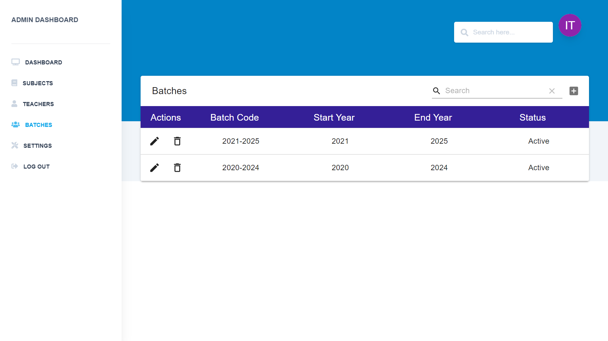
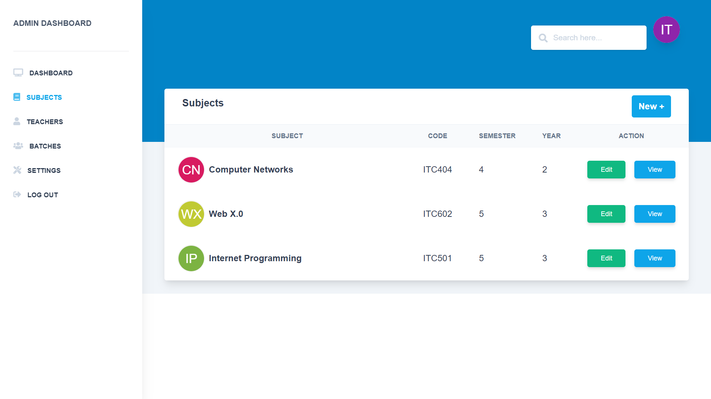
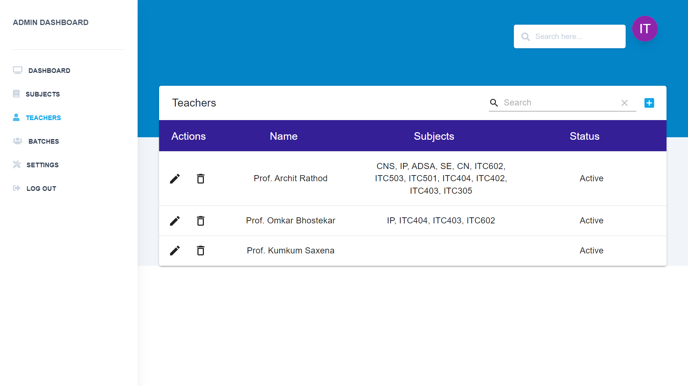
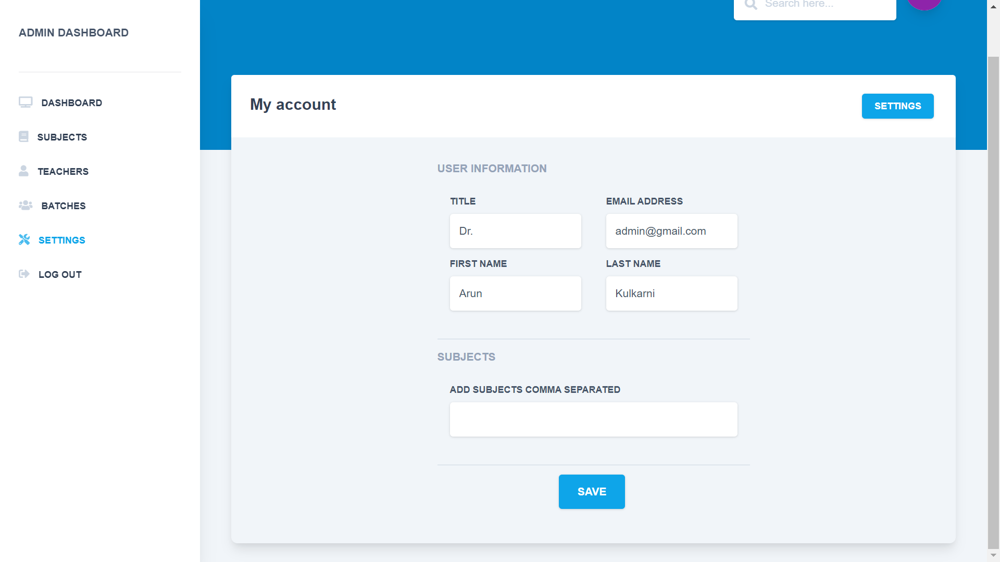

# Edu Sys (CO - PO - PSO Mapping System) - A complete solution for your college.

## Edu Sys is an attempt to reduce the manual work of teachers and by automating the entire flow of Outcome Based Education (OBE) system for a college.

## Currently this software is being used by the Information Technology Department of Thadomal Shahani Engineeriing College[.](https://tsec.edu/), Bandra.

### Live Demo : Click [here](https://edusys-tsec.vercel.app/)

## Tech Stack Used

1. Frontend
    a. React JS
    b. Tailwind CSS

2. Backend
    a. Node.js (Express)
    b. Mongo DB

## Relevant Features

1. Seperate Dashboards for Teachers and Admin (HOD).
2. Admin controls all the batches and subjects.
3. Teachers ca self assign themselves subjects and batches.
4. All calculations performed using the latest Rubrics provided by Mumbai University(MU).
5. System generates overall mapping of all subjects batchwise.
6. Secure Login and Signup pages and Database Connectivity.

## Deployment

1. Frontend - Netlify
2. Backend - Microsoft Azure

## Sample Screenshots

### Landing Pages

### Login Page

### Signup Page

### Admin Dashboard - Home

### Admin Dashboard - Batches

### Admin Dashboard - Subjects

### Admin Dashboard - Teachers

### Admin Dashboard - Settings

### Teacher Dashboard - Home

### Teacher Dashboard - Subject CO-PO-PSO Calculation

[Edusys Backend](https://github.com/Archit1706/EduSys-Backend)
